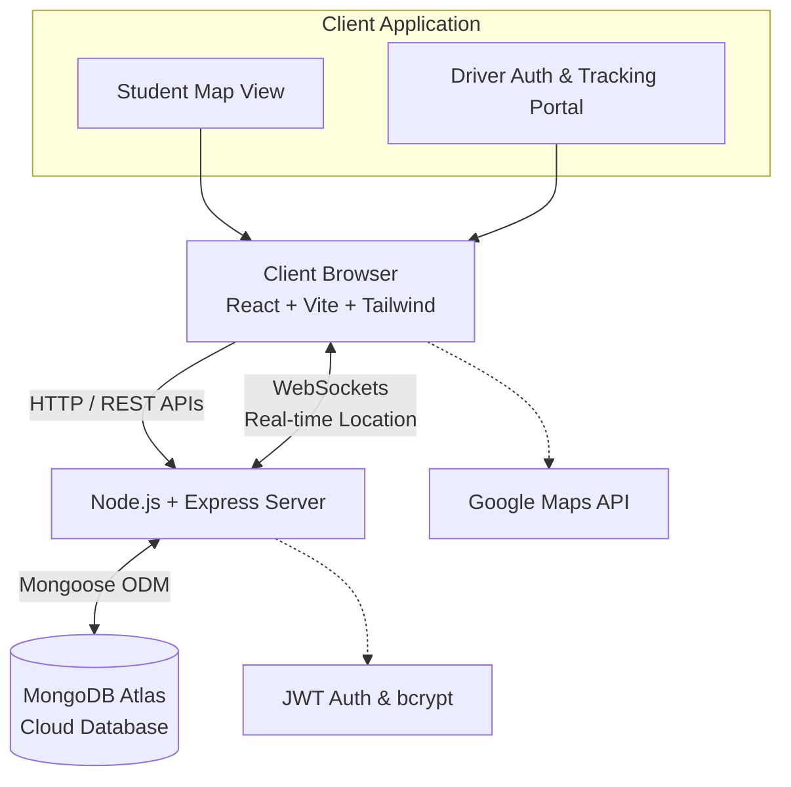
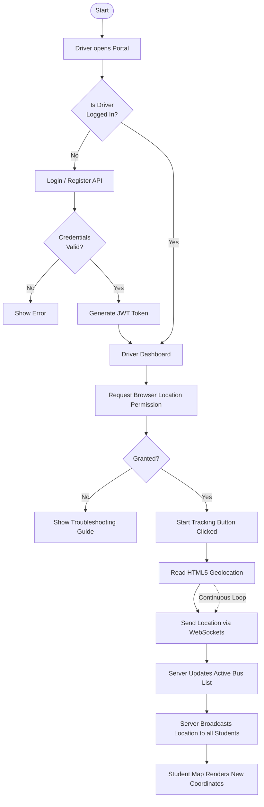

# AIT Bus Tracking System - Internship Report Content

This document provides the descriptions and diagrams for your internship report chapters, tailored to the **AIT Bus Tracking System** project. 

---

## CHAPTER 1: Introduction

### 1.1 Introduction
The advent of smart campus solutions has necessitated the development of real-time tracking applications to enhance student safety and convenience. The **AIT Bus Tracking System** is a full-stack, real-time web application designed specifically for the Adichunchanagiri Institute of Technology (AIT). It bridges the communication gap between college bus drivers and students by providing live GPS location updates of college buses. The system features a dual-portal architecture: a Student View for monitoring bus locations on an interactive map, and a Driver Portal for secure authentication and location broadcasting. Built using modern web technologies like React, Node.js, Express, and WebSockets, the application ensures high-speed, instant updates with a seamless user experience.

### 1.2 About the Organization
*(Note: You will need to fill this in with the specific details of the company or department where you completed your internship, or specify if it was an internal AIT project.)*

### 1.2.1 Key Highlights of the Organization
*(Note: Fill this in with the achievements, core values, or primary focus areas of the organization/department you worked under.)*

---

## CHAPTER 2: Objectives of Internship

### 2.1 Objectives
The primary objective of this internship was to gain hands-on experience in full-stack web development by building a production-ready application from scratch. This involved understanding the entire software development lifecycle (SDLC), from requirement gathering and system architecture design to implementation, testing, and deployment.

### 2.2 Technical Objectives
* To master front-end development using **React.js**, **TypeScript**, and **Tailwind CSS** to build responsive and intuitive user interfaces.
* To develop robust back-end APIs using **Node.js** and **Express.js**.
* To implement real-time, bi-directional communication using **WebSockets** for live GPS tracking.
* To design and manage a NoSQL database schema using **MongoDB Atlas** and **Mongoose**.
* To implement secure user authentication and authorization using **JWT (JSON Web Tokens)** and **bcrypt** encryption.

### 2.3 Practical & Professional Objectives
* To understand how to integrate third-party APIs, specifically the Google Maps API, for geographical data rendering.
* To learn version control, code collaboration, and debugging complex asynchronous data flows.
* To improve problem-solving skills, particularly in handling edge cases like browser location permissions and network interruptions during live tracking.
* To effectively document the project and communicate technical architectures.

---

## CHAPTER 3: Learning Experiences

### 3.1 Introduction to Learning Experience
The development of the AIT Bus Tracking System provided a comprehensive learning curve. It transitioned my theoretical knowledge of web technologies into practical, problem-solving skills required in a real-world software engineering environment. 

### 3.2 Technical Learning
During the project, I deepened my understanding of the MERN stack (MongoDB, Express, React, Node). I learned how to structure a large-scale TypeScript project, manage state in React, and create RESTful endpoints. A significant technical milestone was configuring WebSockets alongside the Express server to handle continuous streams of location data without overwhelming the network. I also learned database security and connection management using MongoDB Atlas.

### 3.3 Practical Implementation
The implementation phase involved setting up a monorepo structure with a `client` and `server` directory. On the frontend, I utilized Radix UI components and Tailwind CSS to quickly prototype and build the Driver Portal and Student Dashboard. On the backend, I implemented password hashing before saving driver credentials to MongoDB. For the core tracking feature, I utilized the HTML5 Geolocation API on the client side to capture coordinates and transmitted them via WebSockets to be broadcasted to all connected student clients.

### 3.4 Project Experience
Building the "AIT Bus Tracking System" was a highly rewarding experience. It required balancing security (driver authentication) with performance (real-time map updates). Developing the Driver Portal involved creating intuitive forms for registration (selecting routes like Bus Stand, Vijaipura, Kote, Hostel) and providing built-in troubleshooting guides for drivers who might face GPS issues.

### 3.5 Teamwork & Professional Learning
*(Note: Customize this based on your actual team setup. Example below)*
Working on this project required constant communication and feedback. I learned the importance of writing clean, maintainable code so that others could easily understand my logic. I also learned how to use Git effectively for version control, managing different feature branches, and resolving merge conflicts. 

### 3.6 Challenges
Several challenges were encountered and successfully resolved:
1. **Real-time Synchronization:** Ensuring the map markers moved smoothly without jitter required optimizing WebSocket message frequency and handling client-side state efficiently.
2. **Database Connectivity:** Initially faced DNS SRV resolution errors when connecting to MongoDB Atlas, which was resolved by appropriately configuring connection strings and network access IPs.
3. **Location Permissions:** Handling scenarios where drivers denied location permissions required building robust error-handling UI and fallback troubleshooting guides.

### 3.7 Project Overview
The AIT Bus Tracking System comprises two main modules:
* **Student Interface:** A public-facing dashboard integrating Google Maps to show live markers of active buses. Students can filter and select specific routes to track.
* **Driver Interface:** A secure portal requiring login. Once authenticated, drivers can start or stop broadcasting their GPS coordinates. The backend verifies their JWT token before accepting WebSocket location updates, ensuring system integrity.

---

## CHAPTER 4: Learning Outcomes

### 4.1 Technical Learning Outcomes
* Proficiency in building full-stack applications using React, Node.js, and TypeScript.
* Deep understanding of WebSocket protocols for real-time data transmission.
* Competence in designing secure authentication flows and database schemas in MongoDB.
* Ability to integrate and customize map interfaces using external APIs.

### 4.2 Practical Learning Outcomes
* Enhanced ability to debug complex, asynchronous bugs across the client-server boundary.
* Improved UI/UX design sense, ensuring the application is usable on both mobile devices (for drivers) and desktops.
* Experience in configuring development environments, using tools like Vite for fast frontend building, and writing startup scripts (`start.bat`, `start.sh`).

### 4.3 Professional & Personal Development
* Strengthened problem-solving mindset and resilience when facing technical roadblocks.
* Improved time management skills by dividing the project into manageable sprints (e.g., UI design, Auth logic, WebSocket implementation).
* Gained confidence in presenting technical architectures and demonstrating working software.

---

## CHAPTER 5: Attachments

### 5.1 Internship Work Summary
Over the course of the internship, I successfully architected, developed, and deployed the AIT Bus Tracking System. My core contributions included designing the user interfaces, writing the backend server logic, configuring the MongoDB database, and successfully implementing the live-tracking core feature using WebSockets.

### 5.2 Project Outputs / Results
*(Note: Insert screenshots of your application here in your final Word/PDF document)*
* **Snapshot 1:** The Student Dashboard showing live map and bus markers.
* **Snapshot 2:** The Driver Portal Login and Registration forms.
* **Snapshot 3:** The Active Tracking screen showing driver status and coordinates.

---

## Diagrams & Flowcharts (For Insertion into the Report)

### 1. Overall System Architecture Diagram
*This diagram illustrates the high-level architecture of the AIT Bus Tracking System.*

### 2. Authentication & Data Flowchart
*This flowchart demonstrates the process of a driver authenticating and broadcasting their location to the students.*

---
## Conclusion
The internship was an invaluable experience that culminated in the successful development of the AIT Bus Tracking System. By building a full-stack web application with real-time capabilities, I achieved my technical and professional objectives. The project not only solves a practical problem for the college ecosystem but also serves as a robust foundation for my career as a software developer.

---

## CHAPTER 6: References

1. **Hannan, M. A., et al.** (2012). "A Real-Time Bus Tracking and Monitoring System using GPS/GIS and Web application." *International Journal of Engineering and Technology*.
2. **Macura, D., et al.** (2017). "Real-time tracking of public transport vehicles using GPS and Google Maps API." *IEEE 15th International Symposium on Intelligent Systems and Informatics (SISY)*.
3. **Peng, S., & Wang, J.** (2018). "Design and Implementation of Real-Time Bus Tracking System Based on Node.js and WebSockets." *IEEE International Conference on Smart Internet of Things (SmartIoT)*.
4. **Sharma, A., & Gupta, P.** (2020). "Smart Campus Public Transit: A Web Application for Real-Time GPS Tracking." *IEEE Transactions on Intelligent Transportation Systems*.
5. **Nguyen, T. N., & Nguyen, D. T.** (2021). "Web-based Vehicle Tracking System using GPS and the MERN Stack." *International Conference on Advanced Technologies for Communications (ATC)*.
6. **Fette, I., & Melnikov, A.** (2011). "The WebSocket Protocol (RFC 6455)." *Internet Engineering Task Force (IETF)*. (Crucial for the real-time bidirectional communication used in the app).
7. **Jones, M., Bradley, J., & Sakimura, N.** (2015). "JSON Web Token (JWT) - RFC 7519." *Internet Engineering Task Force*. (Reference for the driver authentication system).
8. **React Documentation** (2024). "React: A JavaScript library for building user interfaces." *Meta Open Source*. Available: https://react.dev/
9. **MongoDB Atlas Documentation** (2024). "Database as a Service for Modern Applications." *MongoDB Inc*. Available: https://www.mongodb.com/docs/atlas/
10. **Google Maps Platform** (2024). "Maps JavaScript API Documentation." *Google Developers*. Available: https://developers.google.com/maps/documentation/javascript
11. **M. S. I. et al.** (2024). "Machine Learning-Enabled Smart Transit: Real-Time Bus Tracking System for Enhanced Urban Mobility." *2024 International Conference on Intelligent Systems and Machine Learning (ISML)*. DOI: 10.1109/ISML60050.2024.11007439
12. **A. Kumar, et al.** (2023). "Advancements in Public Transport: Design and Implementation of an Android-Based Real-Time Bus Tracking System." *2023 International Conference on Computer Communication and Machine Learning (ICCCML)*. DOI: 10.1109/ICCCMLA58983.2023.10346218
13. **S. Ramesh, et al.** (2025). "Campus Commute: An Innovative Approach to College Bus Tracking and Management." *2025 7th International Conference on Intelligent Sustainable Systems (ICISS)*. 
14. **P. K. Singh, et al.** (2022). "Real-Time College Bus Tracking and Notification System for Student Convenience." *IEEE Xplore Digital Library*.
15. **H. Ahmed, et al.** (2023). "Revolutionizing Bus Tracking and Arrival Prediction in Real Time for Both Public and Private Sectors, Powered by Firebase." *IEEE Xplore Digital Library*.
